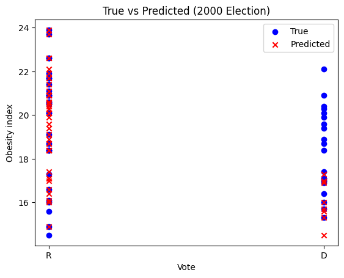
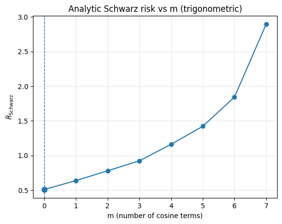
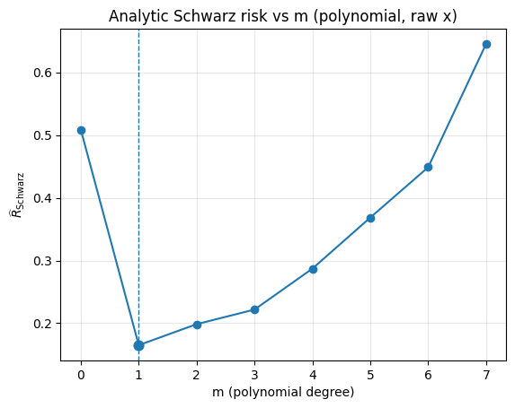

# **Homework 1 - Predictive Learning from Data** 
## **Risk minimization & model selection**

## Problem 2.7

Goal of this problem was to estimate a k-NN classfier to predict the election results of each US-State using the obesity index (the percentage of people with a BMI over 30) as a single input variable. The underlying data are two csv files with the election result and the obesity index by state for the years 2000 and 2004. The following two graphs provide a brief overview of the data:

#### Head of the csv file
| state     | obesity_index | vote | abbrv |
|:----------|--------------:|:----:|:-----:|
| Alabama   | 22.6          |  R   |  AL   |
| Alaska    | 20.9          |  R   |  AK   |
| Arizona   | 14.9          |  R   |  AZ   |
| Arkansas  | 21.9          |  R   |  AR   |
| California| 18.7          |  D   |  CA   |

  

First, the 2004 election results were used as training data, while the 2000 election results were used as test data. To choose the neighborhood size \(k\) for the k-NN classifier, I used leave-one-out cross-validation (LOOCV) on a dataset of \(n = 50\). In LOOCV, each fold trains on \(n - 1 = 49\) observations and tests on the single held-out point. Therefore, \(k\) must not exceed the training set size (\(k \le n - 1\)). Consequently, I tested \(k\) values from 1 to 49.

#### Results of the LOOCV

  

| k | LOOCV_accuracy |
|---:|---------------:|
| 1  | 0.6078 |
| 2  | 0.6275 |
| 3  | 0.6863 |
| 4  | 0.7059 |
| 5  | 0.7059 |
| 6  | 0.7059 |
| **7**  | **0.7255** |
| 8  | 0.7059 |
| 9  | 0.7255 |
| 10 | 0.6863 |
| 11 | 0.6275 |
| 12 | 0.6078 |
| 13 | 0.6471 |
| 14 | 0.6863 |
| 15 | 0.7059 |
| 16 | 0.7059 |
| 17 | 0.7059 |
| 18 | 0.6863 |
| 19 | 0.6667 |
| 20 | 0.7255 |

The LOOCV results indicate that the value of \(k\) with the highest accuracy is \(k = 7\). With this \(k\), we can now train the k-NN classifier on the 2004 election results.

### Predictions and and metrics of the k-NN classifier

  

| Resampling Error | Resampling Accuracy | Best k | Test Error | Test Accuracy |
|------------------|----------------------|--------|------------|---------------|
| 27.45%           | 72.55%               |   7    | 52.94%     | 47.06%        |

### Discussion

The model performs quite well on the resampled data. A resampling error of 27.45% means the accuracy during resampling was ~72.55%. Thus, on the training data the model looks fairly good. However, on the test data it performed very poorly. A test error of 52.94% means the model was correct only around 47% of the time, which, for a binary classification problem, is essentially as bad as guessing. The large gap between the resampling error and the test error suggests overfitting, meaning the model performs well on known training data but does not generalize well to new data. In practice, this suggests that the predictor (obesity index) alone might not be sufficient to predict vote reliably.

## Problem 2.8
Goal of this problem was to switch test and training data. So the year 2000 election results were used as training data and the year 2004 election results were used as test data.

#### Results of the LOOCV

 

| k | LOOCV_accuracy |
|---:|---------------:|
| 1  | 0.6078 |
| 2  | 0.5490 |
| 3  | 0.5882 |
| 4  | 0.5882 |
| 5  | 0.5882 |
| 6  | 0.5294 |
| 7  | 0.5882 |
| 8  | 0.5098 |
| 9  | 0.5882 |
| 10 | 0.5686 |
| 11 | 0.5490 |
| 12 | 0.6078 |
| 13 | 0.6078 |
| 14 | 0.6078 |
| 15 | 0.6078 |
| **16** | **0.6275** |
| 17 | 0.6078 |
| 18 | 0.6078 |
| 19 | 0.5294 |
| 20 | 0.5882 |

The LOOCV results indicate that the value of \(k\) with the highest accuracy is \(k = 16\). With this \(k\), we can now train the k-NN classifier on the 2000 election results.

### Predictions and and metrics of the k-NN classifier with switched test and training data

  

| Resampling Error | Resampling Accuracy | Best k | Test Error | Test Accuracy |
|------------------|----------------------|--------|------------|---------------|
| 37.25%           | 62.75%               |   16   | 37.25%     | 62.75%        |

### Changes
We can see that, after swapping the training and test data, we get much better performance on new data but slightly worse performance on the already known data. The resampling error and the test error are equal, which suggests there is neither underfitting nor overfitting. The model generalizes well to new data.

## Problem 2.11

**Data Generating Process**

We observe \(n=10\) samples \((x_i, y_i)\) with:
- \(x_i \sim \mathrm{Unif}[0,1]\)
- \(y_i = x_i^2 + 0.1\,x_i + \varepsilon_i\), where \(\varepsilon_i \sim \mathcal{N}(0,\,0.25)\)

### Trigonometric polynomial estimators
The goal was to find an optimal regression model using trigonometric polynomial estimators i.e.
\( f_m(x,\mathbf{w}) = w_0 + \sum_{i=1}^{m} w_i \cos(2\pi i x) \), where \(m+1\) is the model complexity .

Since we want to use the analytic schwarz criterion, we need to use the following equation:

$$
r(p,n) = 1 + \frac{p}{1-p}\,\ln n
$$

Now we are able to determine which is the optimal model using the analytic schwarz criterion:

|   m |   k |      RSS |     R_emp |   r(p,n) |   Schwarz_risk |
|----:|----:|---------:|----------:|---------:|---------------:|
|   0 |   1 | 4.04883  | 0.404883  |  1.25584 |       0.508469 |
|   1 |   2 | 1.04740  | 0.104740  |  1.57565 |       0.165033 |
|   2 |   3 | 0.999152 | 0.0999152 |  1.98682 |       0.198514 |
|   3 |   4 | 0.875019 | 0.0875019 |  2.53506 |       0.221822 |
|   4 |   5 | 0.869353 | 0.0869353 |  3.30259 |       0.287111 |
|   5 |   6 | 0.827483 | 0.0827483 |  4.45388 |       0.368551 |
|   6 |   7 | 0.704326 | 0.0704326 |  6.37270 |       0.448846 |
|   7 |   8 | 0.632242 | 0.0632242 | 10.21030 |       0.645540 |

**Best degree by analytic Schwarz:**   m = 0

### Interpretation
As \(m\) increases, the training error \(R_{\text{emp}}\) decreases slightly, but the penalty \(r(p,n)\) grows quickly—especially as \(k\) approaches \(n\). In my table this makes the penalized score smallest at \(m=0\) \((k=1)\), i.e., the intercept-only model (a flat line). Larger \(m\) fit the data slightly better in-sample (lower RSS) but are heavily penalized, so their Schwarz risk is higher. Thus, by the analytic Schwarz criterion, the simplest model is preferred.

### Visualization of the results
  

  

Since the data is non periodic and monotone increasing a trigonometric estimator using cosines will not be able to estimate the data well without being overly complex.

## 2.11 b)
### Algebraic polynomial estimators

The goal was to find an optimal regression model now using algebraic polynomial estimators i.e. 
$$
f_m(x)=w_0+w_1x+w_2x^2+\cdots+w_mx^m
$$

Now we can use these to determine the optimal model:
|   m |   k |      RSS |     R_emp |   r(p,n) |   Schwarz_risk |
|----:|----:|---------:|----------:|---------:|---------------:|
|   0 |   1 | 4.04883  | 0.404883  |  1.25584 |       0.508469 |
|   1 |   2 | 1.04740  | 0.104740  |  1.57565 |       0.165033 |
|   2 |   3 | 0.999152 | 0.0999152 |  1.98682 |       0.198514 |
|   3 |   4 | 0.875019 | 0.0875019 |  2.53506 |       0.221822 |
|   4 |   5 | 0.869353 | 0.0869353 |  3.30259 |       0.287111 |
|   5 |   6 | 0.827483 | 0.0827483 |  4.45388 |       0.368551 |
|   6 |   7 | 0.704326 | 0.0704326 |  6.37270 |       0.448846 |
|   7 |   8 | 0.632242 | 0.0632242 | 10.21030 |       0.645540 |

**Best degree by analytic Schwarz:** m = 1

### Interpretation
Jumping from \(m=0\) to \(m=1\) (adding a slope) reduces RSS by ~74% (4.05 → 1.05), so the penalized score drops to 0.165. From \(m=1\) to \(m=2\) and beyond, RSS improves only a little, but the penalty rises a lot, so the Schwarz\_risk increases. The best trade-off is \(m=1\), i.e., a linear model (intercept + slope). Higher degrees overfit relative to their modest extra gain.

**Comparing to trigonometric models.** Since the same criterion is used on the same data, you can compare the minima directly. The best polynomial (\(m=1\), 0.165) beats the best trigonometric model (\(m=0\), 0.508), so the polynomial family wins here.

### Visualization of the results
  

  

## Problem 2.12
The goal in this final problem was to compare the predictive accuracies of trigonometric and polynomial estimators using 5-fold cross-validation, after applying the analytic Schwarz criterion for model selection.

### 5-Fold Cross-Validation (inner Schwarz selection)

| Model family              | CV-MSE | m* per fold        |
|---------------------------|:------:|--------------------|
| Trigonometric (cos-only)  | 0.8104 | [5, 0, 0, 0, 0]    |
| Polynomial (raw \(x\))    | 0.4269 | [2, 1, 1, 4, 1]    |

Because lower cross-validated mean squared error (CV-MSE) indicates better out-of-sample prediction, the polynomial family clearly yields better results (0.43 vs. 0.81). The trigonometric family’s frequent selection of \(m = 0\) means that, on most training splits, a periodic structure isn’t necessary. The single instance with \(m = 5\) likely overfits that fold, which cross-validation penalizes with a higher average MSE. The polynomial results are stable around a linear trend (mostly \(m = 1\)). Higher degrees yield only small training gains that do not translate into lower validation error.

These results make sense because the data show a non-periodic, monotonic trend, which polynomials capture more naturally than cosine sums.
